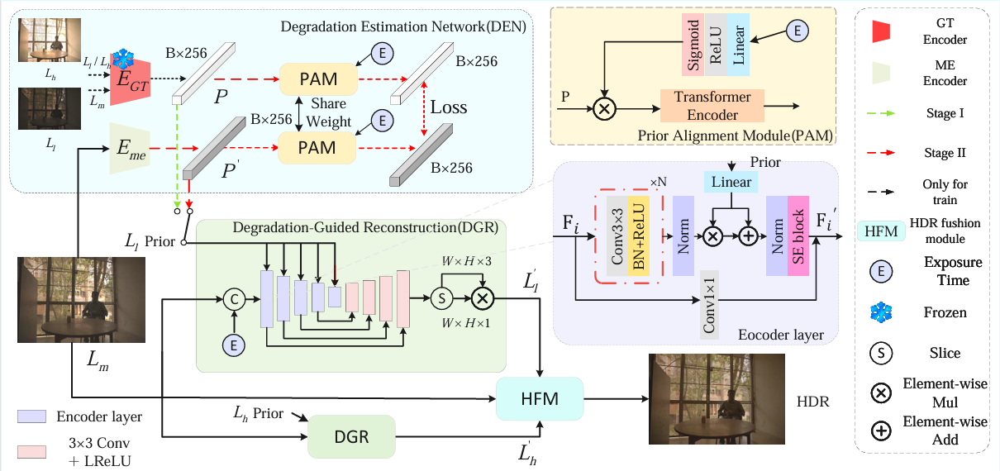

# Guided LDR Generation for Single-Image HDR Reconstruction  Using Degradation Priors from Multi-Exposure Images

**Abstract:** Single-image high dynamic range (HDR) reconstruction remains challenging due to exposure-induced degradations. Several recent methods attempt to synthesize multi-exposure low dynamic range (LDR) images from a single input and fuse them to recover missing content. However, they primarily rely on implicit statistical priors learned from data and do not explicitly extract or constrain exposure-related degradation patterns, which limits their ability to accurately restore detail and color under extreme lighting conditions. To address this, we present a twostage framework, Degradation-Guided Single-Image HDR (DGSHDR), which formulates HDR reconstruction as a pipeline of degradation modeling and degradation-aware image generation. Our framework consists of two core components: 1) a degradation estimation network (DEN) that learns the image degradation prior from medium-low and medium-high exposure image pairs. 2) a U-shaped degradation-guided reconstruction network (DGR) intended to integrate the degradation prior and restore more accurate low- and high-exposure images. These generated images are subsequently fused to produce a high-quality HDR output. Extensive quantitative and qualitative experimental results demonstrate that our method excels in detail, brightness, and color restoration, significantly improving the overall performance of single-image HDR reconstruction.

## 🚀 Get Started

### 1. Clone this repository

```bash
git clone https://github.com/gguoshun/DG-SHDR.git
cd DG-SHDR
```
### 2. Setup the environment
```bash
conda create -n DG-SHDR python=3.8
pip install -r requirements.txt
```


## 🏋️ Dataset
| Dataset | Link | Password |
|:-------:|:----:|:--------:|
| challenge123 | [Link](https://pan.baidu.com/s/1A54sa8bZ_HJBjT4g0fP0xg?pwd=d63v) | `d63v` |
| our dataset | [Link](https://pan.baidu.com/s/1eR08fOuLep3eIVSq9vEpBw?pwd=gcq3) | `gcq3` |


## Training and evaluation
### data preprocess
Before starting training, you can choose to use **data_preprocess.py** to preprocess the dataset so that it fits our dataset loading method. Alternatively, you may use your own dataset as needed.

### Training
```bash
pyhton mian1.py
```
### Testing
To generate the final hdr images, run the following command:
```bash
python test.py --load 2
```
